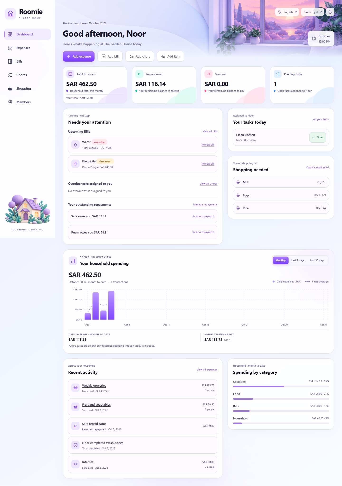
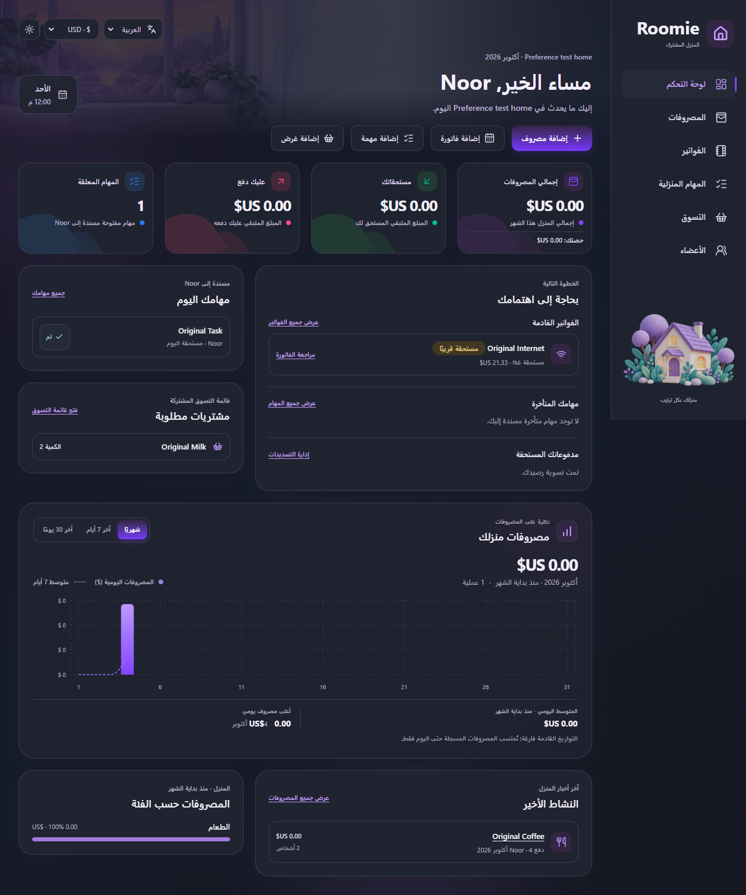

# Roomie

[](https://github.com/noorkamleh/roomie/actions/workflows/ci.yml)

A React and TypeScript application for managing a shared home's expenses, balances, bills, chores, and shopping. The project combines a responsive interface with tested financial rules and English/Arabic support.

**Current scope:** a browser-only application with local persistence. Household data is shared between tabs of the same browser and origin; accounts and sharing between devices are future work.

## Preview

| English · light theme                                                                                                                                                        | Arabic · dark theme                                                                                                                                                  |
| ---------------------------------------------------------------------------------------------------------------------------------------------------------------------------- | -------------------------------------------------------------------------------------------------------------------------------------------------------------------- |
| [](docs/images/dashboard-en.png) | [](docs/images/dashboard-ar-dark.png) |

Screenshots use sample data from the browser tests. Click a preview to see the original image.

## Main features

- **Expenses and budgets:** searchable ledger, cards/list views, month/category/payer filters, equal/exact/percentage splits, and monthly/category spending limits.
- **Balances and repayments:** derived member balances, partial settlements, repayment history, and optional debt simplification.
- **Recurring household work:** monthly bills create linked expenses when paid; recurring chores keep completion history, rotate assignments, and support swap requests.
- **Shopping and members:** quantities and units, purchases recorded as shared expenses, and member archiving that preserves financial history.
- **Display preferences:** English/Arabic with RTL, light/dark themes, and SAR/USD entry and display. Stored amounts stay in SAR.
- **Reliability:** validated browser storage, protection against stale writes, Undo, tab synchronization, and a reload action when a page fails to download. Layouts are tested down to 320px.

## Run locally

Use **Node.js 22.18+** and npm. No external service or account is required.

```sh
npm ci
npm run dev
```

Open the URL printed by Vite. For a populated demonstration, open **Members → Household → Load demo data**. This replaces the current browser household with sample records dated relative to today and can be undone immediately.

## Checks

```sh
npm run format:check
npm run lint
npm test
npm run build
npm run test:e2e
npm run test:e2e:production
```

Browser tests require installed **Google Chrome** and start their own server on port **4173**. The production command builds the app and runs the same scenarios against `dist`. Unit tests cover financial calculations, recurrence, validation, and persistence; browser tests cover user workflows, both languages, narrow screens, and recovery scenarios. TypeScript strict checks are enabled.

[GitHub Actions](.github/workflows/ci.yml) runs formatting, lint, unit tests, the production build, and Chrome workflow tests on pushes and pull requests using Node.js 24.

## Architecture and financial rules

The source is organized by feature: `app/` owns routing and the shell, `features/` owns screens and domain logic, and `shared/` contains reusable UI, types, formatting, and preferences. Pure functions calculate finances; household commands validate and persist complete state changes before publishing them to React.

Money is recorded as integer SAR halalas. Currency selection uses the application's fixed rate of **1 USD = 3.75 SAR**; it is not a live exchange-rate feed. Equal splits allocate remaining halalas deterministically: **100 SAR → 33.34 + 33.33 + 33.33**. Exact and percentage splits validate their totals, and unchanged edits preserve the original stored cents. Repayments affect balances without increasing household spending.

See [Architecture and domain rules](docs/ARCHITECTURE.md) for data flow, rounding, linked records, and persistence guarantees.

## Storage and deployment

Records belong to this browser and site origin. Changing the browser, domain, or port does not transfer data. The member selector changes the viewing perspective; it is not authentication. Export/import backups and a shared backend are not implemented. Snapshot checks reject stale actions, but the browser storage comparison and write are separate operations and do not guarantee simultaneous writes across tabs.

To deploy, build and publish `dist`. The host must serve `index.html` for application routes such as `/expenses` and `/members`, while serving existing assets normally. No hosting provider or deployment pipeline is configured in this repository.

## Further reading

- [Interview guide](docs/INTERVIEW_GUIDE.md): a short demo and code walkthrough.
- [Architecture and domain rules](docs/ARCHITECTURE.md): implementation details and tradeoffs.
- [Project review — العربية](PROJECT_REVIEW.md): recorded validation results, completed fixes, and remaining work.
- [Contribution conventions](src/AGENTS.md) and [generated asset provenance](src/assets/roomie-backgrounds.md).
